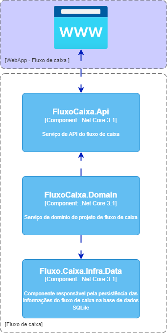

# Projeto do desafio 
Este projeto tem como objetivo demonstrar algumas das habilidades tecnicas de desenvolvimento de software.

## Desenho da solução:


## Boas praticas:
Padrões de projetos adotados no projeto: 
  * Repository
  * Adapter

Modelagem e boas práticas de software: 
* DDD - Domain Driven Design
Observação: Não foi utilizada todas as tecnicas deste modelo de desenvolvimento devido ao tamanho do projeto.

Frameworks:
* Entity framework
* Fluent Validation
* AutoMapper

Base de dados: 
* SQLite

## Instruções para execução do projeto local:
Detalhes tecnicos: 
* Linguagem de desenvolvimento: 
  * C# 
  * .NET Core 3.1
* Baixar o código do github comandos: 
```
  git clone ???
```
Abrir o projeto a soluction no Visual Studio 2019/2022 ou no Visual Studio Code

## Repositorio publico: